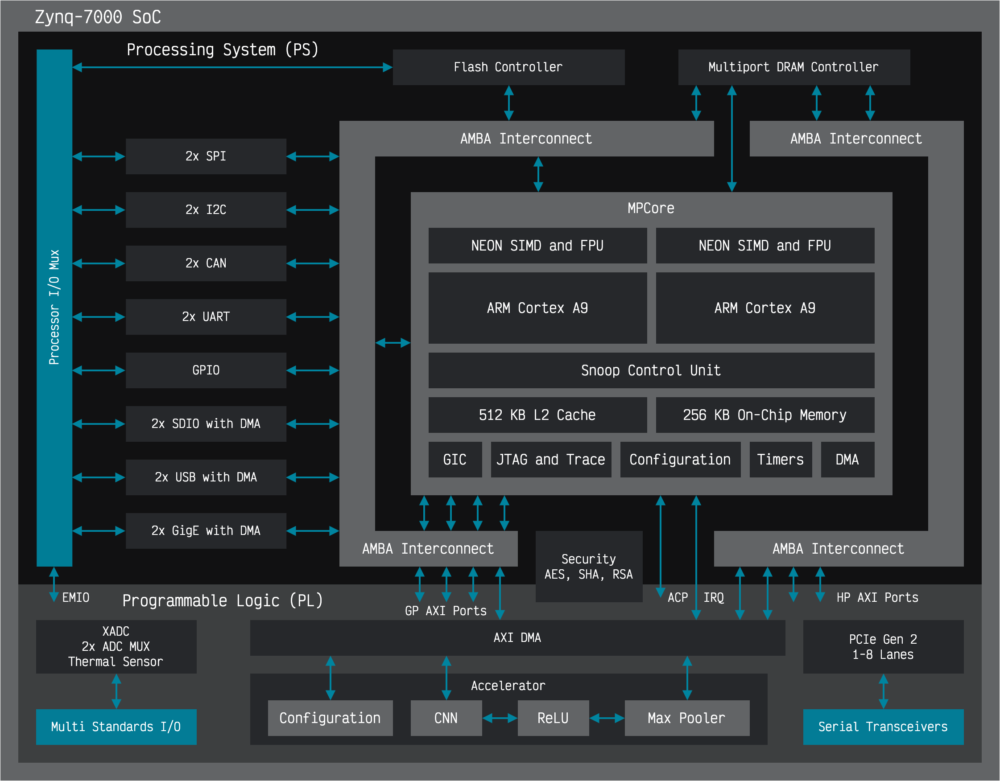

# FPGA-Accelerated Convolutional Neural Network

This project implements a CNN accelerator pipeline on an Arty Z7-20 board with a Xilinx Zynq-7000 SoC. It offloads compute-intensive CNN operations to custom FPGA hardware while the ARM processor handles configuration and control. This hardware-software co-design achieves over 100x speedup, significantly improving execution speed compared to a software-only approach.

## Implementation


The CNN accelerator is implemented as a hardware-software system, with computation offloaded to FPGA fabric while the ARM processor handles configuration and control. Data movement is managed using Xilinx’s AXI DMA IP, which transfers input and output data between memory and the accelerator over two high-performance AXI4-Stream interfaces. The CPU configures the accelerator and the DMA engine through an AXI4-Lite interface connected to the general-purpose AXI interconnect. Interrupts from the DMA signal the CPU when transfers complete, ensuring efficient synchronization without polling.

### Hardware Components

Data flows through the accelerator over AXI4-Stream interfaces with backpressure handling. The main processing blocks are:
- **Convolution Engine**: A pipelined DSP-based unit that performs fixed-point multiply-accumulate operations.
- **ReLU Activation**: A combinational module that applies the ReLU function using sign-bit detection.
- **Max Pooling**: A DSP-inspired architecture that processes data in a streaming manner, extracting the maximum value within a configurable window.

### Software Stack
The software stack includes a reference model, control, data management, and validation tools for managing the accelerator. It includes:
- **Hardware Abstraction Layer (HAL)**: A structured API for configuring and controlling the accelerator.
- **Memory Management**: A custom allocator ensuring a shared memory model for software and hardware, enabling zero-copy DMA transfers.
- **Bit-Exact Software Model**: A reference implementation that mirrors hardware behavior for validation and performance comparison.
- **Benchmarking Framework**: Tools for measuring execution time and comparing hardware vs. software performance.
- **Fixed-Point Library**: A software library ensuring numerical consistency between software and hardware calculations.

## Performance Results

The hardware accelerator demonstrates notable speedup compared to software-only implementation:

| Input Size | SW Execution (μs) | HW Execution (μs) | Speedup |
|------------|-------------------|-------------------|---------|
| 8x8        | 77.16             | 5.61              | 14x     |
| 32x32      | 1895.20           | 17.84             | 106x    |
| 128x128    | 33421.42          | 216.08            | 155x    |
| 1024×1024  | 219871494.42      | 10502.34          | 209x    |

*Note: Performance measured on Arty Z7-20 development board with Zynq-7000 SoC running at 100MHz*

## Hardware Utilization
The table below shows the FPGA resource usage when synthesizing the accelerator for the Arty Z7-20 board:
| Resource | Used | Available | Utilization |
|----------|------|-----------|-------------|
| LUTs     | 7,274| 53,200    | 13.7%       |
| FFs      | 7,373| 106,400   | 6.9%        |
| DSPs     | 36   | 220       | 16.4%       |
| BRAM     | 2    | 140       | 1.4%        |

## Build Instructions

### Prerequisites
- Xilinx Vivado Design Suite 2023.2 or newer
- Xilinx Vitis IDE 2023.2 or newer
- Arty Z7-20 development board
- Digilent board files (required for Vivado)

### Hardware Build

Either run the batch script to build multiple configurations:
```bash
./scripts/build.sh
```

Or run Vivado directly in batch mode for a specific configuration:
```bash
vivado -mode batch -source scripts/build_hw.tcl -tclargs <INPUT_SIZE> <KERNEL_SIZE> <STRIDE> <POOL_SIZE> <DATA_WIDTH> <FRAC_BITS>
```

To make the script run properly, ensure that the board files are located at:
```bash
$HOME/.Xilinx/Vivado/2024.2/xhub/board_store/xilinx_board_store
```

If the board files are missing, download them from [Digilent’s GitHub repository](https://github.com/Digilent/vivado-boards) and place them in the correct directory.

### Software Build
1. Launch Vitis IDE
2. Create platform project using the generated XSA from build/platforms/
3. Create application project targeting the platform
4. Import source files from `sw/` directory
5. Build and run on hardware (115200 baud UART)

## Repository Structure
The repository is organized as follows:
```bash
cnn-accelerator/
├── hw/                  # Hardware
│   ├── constraints/     # FPGA constraints files
│   ├── model/           # Hardware reference models
│   ├── rtl/             # RTL implementation files
│   └── tb/              # Testbenches
├── sw/                  # Software
│   ├── common/          # Shared utilities
│   ├── cnn/             # CNN software model
│   ├── hal/             # Hardware Abstraction Layer (HAL)
│   └── utils/           # Benchmarking framework
├── media/               # Block diagram
├── scripts/             # Build and automation scripts
├── README.md
└── LICENSE
```

## Future Enhancements
Potential areas for future development:
- Support for deeper CNN models with multiple layers
- Implementation of additional layer types, such as fully connected layers
- Integration with a popular ML framework

## License
This project is available under the [MIT License](LICENSE).
