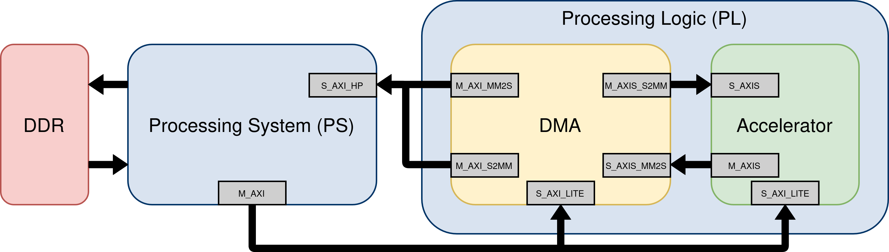
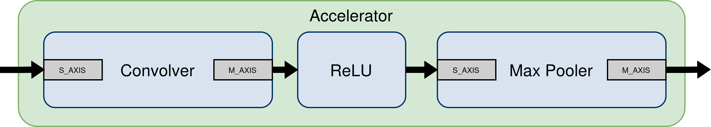
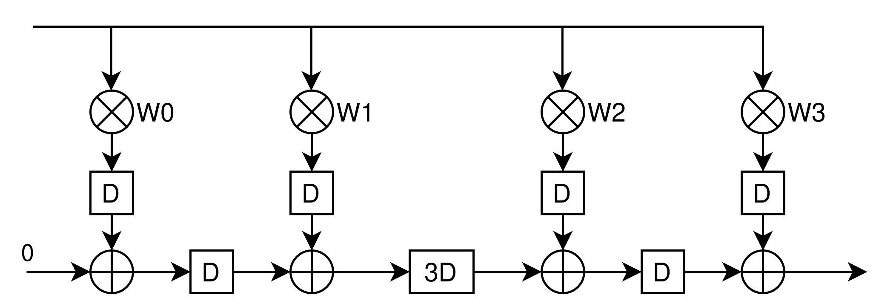

# FPGA-Accelerated Convolutional Neural Network

An implementation of a convolutional neural network (CNN) accelerator on a Xilinx Zynq-7000 SoC, demonstrating hardware-software co-design principles. This project features a custom FPGA-based CNN computation pipeline with software validation and control running on the ARM processing system.

## Project Overview

This accelerator implements the forward pass of a CNN with three key operations:
- Convolution with configurable kernel weights
- ReLU activation function
- Max pooling

The system achieves significant performance improvements over software-only execution through:
- Parallel computation in custom hardware
- Efficient data movement with DMA
- Pipelined streaming architecture
- Fixed-point arithmetic optimized for FPGA implementation

## Technical Implementation

### Hardware Components
- **Streaming Architecture**: Hardware modules connect via AXI-Stream interfaces, supporting backpressure for robust data flow control
- **Convolution Engine**: Pipelined multiply-accumulate operations with fixed-point arithmetic
- **Activation Function**: Combinational ReLU implementation with sign-bit detection
- **Pooling Module**: Streaming max pooling with configurable window parameters
- **AXI4-Lite Interface**: Software-accessible control registers for configuration
- **DMA Integration**: Zero-copy data transfer between DDR memory and accelerator

### Software Components
- **Hardware Abstraction Layer**: Clean driver API for accelerator control
- **Memory Management**: Bump allocator with cache management operations
- **Bit-Exact Software Model**: Reference implementation matching hardware behavior
- **Benchmarking Framework**: Performance measurement and comparison tools
- **Fixed-Point Library**: Software arithmetic matching hardware computation

### System Architecture

The design follows a clean separation between processing system (PS) and programmable logic (PL):




### Accelerator Design

The CNN accelerator pipeline consists of three main processing stages, each optimized for its specific function:



These modules are connected via AXI Stream interfaces, enabling backpressure handling throughout the pipeline. Each module can signal when it's ready to receive new data, creating a robust architecture that adapts to processing delays and ensures no data is lost during computation.

#### Convolver Implementation

The convolution engine employs a DSP-inspired architecture to efficiently process input data:



The diagram illustrates the convolver implementation for INPUT_SIZE=4 and KERNEL_SIZE=2. The actual implementation dynamically adapts to arbitrary dimensions defined at build time through the hardware parameters.

## Performance Results

The hardware accelerator demonstrates notable speedup compared to software-only implementation:

| Input Size | SW Execution (μs) | HW Execution (μs) | Speedup |
|------------|-------------------|-------------------|---------|
| 4×4        | 9.63              | 5.04              | 2x      |
| 8x8        | 77.16             | 5.61              | 14x     |
| 16x16      | 413.89            | 7.98              | 52x     |
| 32x32      | 1895.20           | 17.84             | 106x    |
| 64x64      | 8088.52           | 57.55             | 141x    |
| 128x128    | 33421.42          | 216.08            | 155x    |
| 256×256    | 135826.04         | 820.45            | 166x    |
| 512×512    | 547491.10         | 2917.21           | 188x    |
| 1024×1024  | 219871494.42      | 10502.34          | 209x    |

*Note: Performance measured on Arty Z7-20 development board with Zynq-7000 SoC running at 100MHz*

## Hardware Resource Utilization

| Resource | Used | Available | Utilization |
|----------|------|-----------|-------------|
| LUTs     | 7,274| 53,200    | 13.7%       |
| FFs      | 7,373| 106,400   | 6.9%        |
| DSPs     | 36   | 220       | 16.4%       |
| BRAM     | 2    | 140       | 1.4%        |


## Build Instructions

### Prerequisites
- Xilinx Vivado Design Suite 2023.2 or newer
- Xilinx Vitis IDE 2023.2 or newer
- Arty Z7-20 development board

### Hardware Build

Either run the batch script to build multiple configurations:
```bash
cd scripts
./build.sh
```

Or run Vivado directly in batch mode for a specific configuration:
```bash
vivado -mode batch -source scripts/build_hw.tcl -tclargs <INPUT_SIZE> <KERNEL_SIZE> <STRIDE> <POOL_SIZE> <DATA_WIDTH> <FRAC_BITS>
```

### Software Build
1. Launch Vitis IDE
2. Create platform project using the generated XSA from build/platforms/
3. Create application project targeting the platform
4. Import source files from `sw/` directory
5. Build and run on hardware (115200 baud UART)

## Repository Structure

```
accelerator/
├── hw/                  
│   ├── constraints/    
│   ├── model/           
│   ├── rtl/             
│   └── tb/              
├── sw/                  
│   ├── common/          
│   ├── cnn/             
│   ├── hal/             
│   └── utils/           
├── design/              
├── scripts/             
├── README.md
└── LICENSE
```

## Future Enhancements
Potential areas for future development:
- Support for larger CNN models with multiple layers
- Additional layer types (e.g., fully connected)
- Integration with a popular ML framework

## License
This project is available under the [MIT License](LICENSE).
